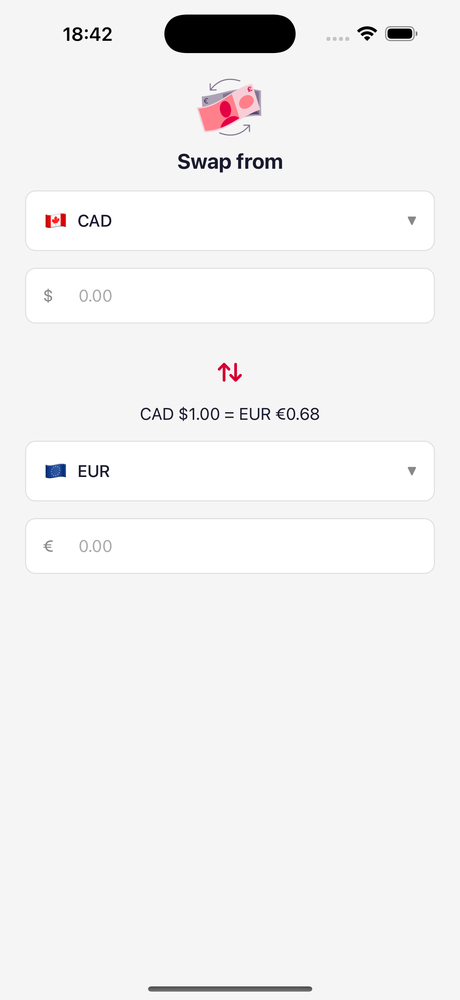

# Currency Converter

A React Native currency conversion app built with Expo, TypeScript, and TanStack Query.

## Screenshots

## Screenshots

## Screenshots

| Splash Screen | Converter |
|---|---|
|  |  |

## Prerequisites

- Node.js 18+
- Expo Go app on your device (SDK 54)
- Mock server running locally

## Getting Started

### 1. Clone the repository

```bash
git clone https://github.com/umerdogar/CurrencyConverter.git
cd CurrencyConverter
```

### 2. Set up environment variables

Copy the example env file and update the API URL with your local IP:

```bash
cp .env.example .env
```

Update `EXPO_PUBLIC_API_URL` in `.env` with your machine's local IP:


To find your local IP:

```bash
ipconfig getifaddr en0
```

### 3. Start the mock server

```bash
git clone https://github.com/stuartmcvean/ExchangeRateTestData.git
cd ExchangeRateTestData
npm install
node server.js
```

### 4. Install dependencies

```bash
cd CurrencyConverter
npm install 
```

### 5. Start the app

```bash
npx expo start
```

Scan the QR code with Expo Go on your device.

## Running Tests

```bash
npm test
```

## Running Type Check

```bash
npm run typecheck
```

## Tech Stack

- **React Native** with Expo SDK 54
- **TypeScript**
- **TanStack Query** — API fetching and caching
- **AsyncStorage** — persisting last selected currencies
- **react-native-svg** — SVG asset support
- **react-native-safe-area-context** — safe area handling
- **Jest** + **Testing Library** — unit and component tests
- **GitHub Actions** — CI/CD pipeline

## Features

- Live exchange rates from local mock API
- Bidirectional currency conversion
- Swap currencies instantly with the swap button
- Persists last selected currencies across app restarts
- API-driven currency list — currencies removed from API are automatically removed from the app
- Japanese Yen displayed with 0 decimal places
- Smooth splash screen with loading animation while rates load
- Rate comparison line showing 1 unit of from currency to to currency
- Same currency selection prevention with popup alert
- Keyboard dismisses on tap outside
- CI/CD via GitHub Actions

## Architecture