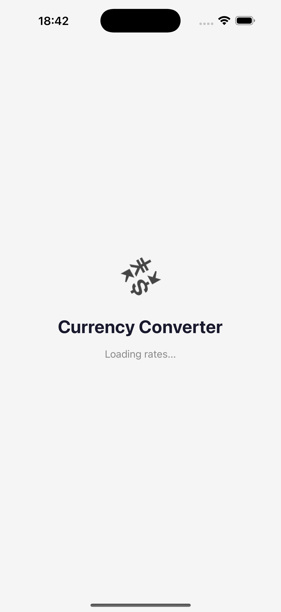

# Currency Converter

A React Native currency conversion app built with Expo, TypeScript, and TanStack Query.

## Screenshots

## Screenshots

## Screenshots

| Splash Screen | Converter |
|---|---|
|  |  |

## Prerequisites

- Node.js 18+
- Expo Go app on your device (SDK 54)
- Mock server running locally

## Getting Started

### 1. Clone the repository

```bash
git clone https://github.com/umerdogar/CurrencyConverter.git
cd CurrencyConverter
```

### 2. Set up environment variables

Copy the example env file and update the API URL with your local IP:

```bash
cp .env.example .env
```

Update `EXPO_PUBLIC_API_URL` in `.env` with your machine's local IP: